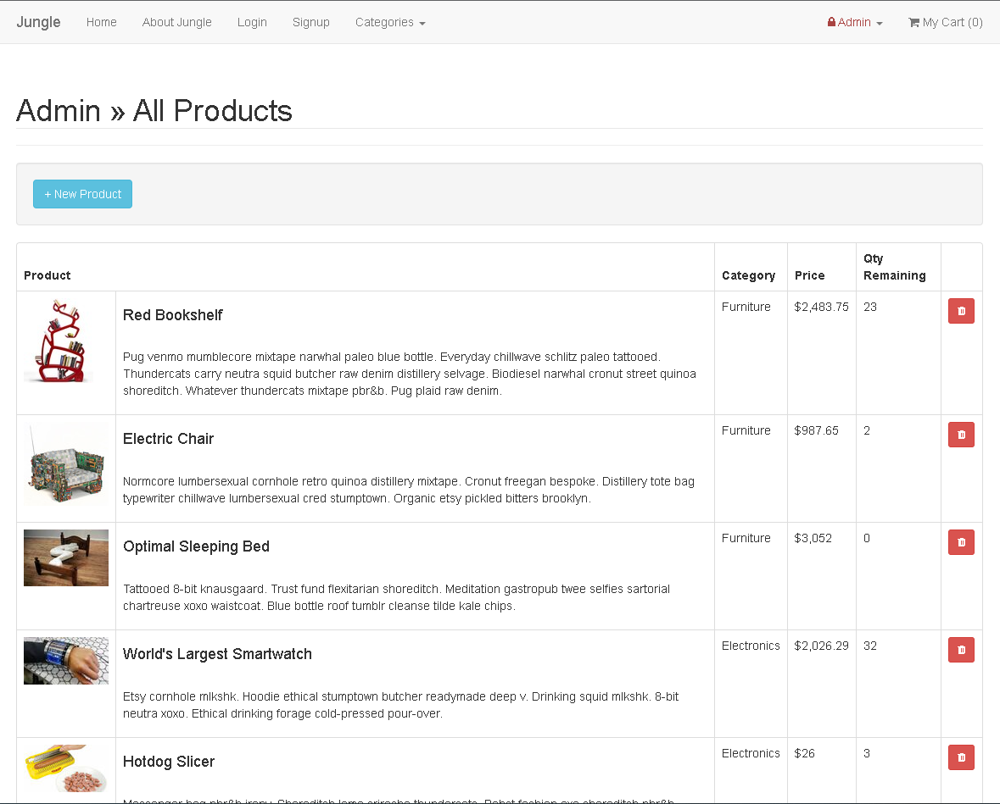

# Jungle

A mini e-commerce application built with Rails 4.2, using Active Record and Active Mailer.

# Features

## Landing page
* Displays all available products currently seeded to the project
* Sold out badges will be added to any products where quantity is 0
* Login/register, admin dashboard and new product/category, and shopping cart are available via the top nav
* Add button in product previews will ofcourse add the product to the users cart. Cart data is retained via a cookie.
* Clicking on preview will take the user to product details page

<center></center>

________________________________________

## Cart
* Shows all products added to cart by the user (reads from cookie data)
* Displays a price total
* Allows the user to adjust the quantity of items

<center></center>

## Stripe Payment
* Uses the stripe payment API for accepting user payments

<center></center>

________________________________________

## Successful Order
* After a successful charge to the stripe testing card # 4111 1111 1111 1111 (Any date in the future for expiry, any security code 3-4 digits)
* Shows order id, totals, quantities, and purchased items

<center></center>

________________________________________

## Admin Dashboard
* Total count of products in DB
* Category count
* Total products per category

<center></center>

________________________________________


## Admin Products
* Shows all products available with an option to remove a product from the DB
* Allows the adding of a product with the New Product button at the top
* Note: The category admin page is nearly identical

<center></center>

________________________________________

## Admin Add Product form
* Simple form to add to DB
* Button to go back to admin product page
* Note: The category admin page is nearly identical


<center></center>

________________________________________

## Order Mailer
* Upon successful order, an email is added to the tmp/mails file (in development)
* A template containing order information is sent (if in production mode)

<center></center>

________________________________________

## Additional Steps for Apple M1 Machines

1. Ruby 2.6.6 required (`ruby -v`)
1. Install ImageMagick `brew install imagemagick imagemagick@6 --build-from-source`
2. Remove Gemfile.lock
3. Replace Gemfile with:
```
source 'https://rubygems.org'
ruby "2.6.6"

# Bundle edge Rails instead: gem 'rails', github: 'rails/rails'
gem 'rails', '4.2.11'
# Use postgresql as the database for Active Record
gem 'pg', '~> 0.10'
# Use SCSS for stylesheets
gem 'sass-rails', '~> 5.0'
# Use Uglifier as compressor for JavaScript assets
gem 'uglifier', '>= 1.3.0'
# Use CoffeeScript for .coffee assets and views
# gem 'coffee-rails', '~> 4.1.0'
# See https://github.com/rails/execjs#readme for more supported runtimes
# gem 'therubyracer', platforms: :ruby

# Use jquery as the JavaScript library
gem 'jquery-rails'
# Turbolinks makes following links in your web application faster. Read more: https://github.com/rails/turbolinks
gem 'turbolinks'
# Build JSON APIs with ease. Read more: https://github.com/rails/jbuilder
gem 'jbuilder', '~> 2.0'
# bundle exec rake doc:rails generates the API under doc/api.
gem 'sdoc', '~> 0.4.0', group: :doc

# Use ActiveModel has_secure_password
gem 'bcrypt', '~> 3.1.7'

gem 'puma'

gem 'bootstrap-sass', '~> 3.3.6'
gem 'font-awesome-rails'
gem 'money-rails'
gem 'carrierwave'
gem 'rmagick'
gem 'stripe'
gem 'faker'

# Use Capistrano for deployment
# gem 'capistrano-rails', group: :development

group :development, :test do
  # Call 'byebug' anywhere in the code to stop execution and get a debugger console
  gem 'byebug'
  gem 'quiet_assets'
  gem 'dotenv-rails'
end

group :development do
  # Access an IRB console on exception pages or by using <%= console %> in views
  gem 'web-console', '~> 2.0'

  # Spring speeds up development by keeping your application running in the background. Read more: https://github.com/rails/spring
  gem 'spring'
end

group :production do
  gem 'newrelic_rpm'
  gem 'rails_12factor'
end
```

## Setup

1. Run `bundle install` to install dependencies
2. Create `config/database.yml` by copying `config/database.example.yml`
3. Create `config/secrets.yml` by copying `config/secrets.example.yml`
4. Run `bin/rake db:reset` to create, load and seed db
5. Create .env file based on .env.example
6. Sign up for a Stripe account
7. Put Stripe (test) keys into appropriate .env vars
8. Run `bin/rails s -b 0.0.0.0` to start the server

## Stripe Testing

Use Credit Card # 4111 1111 1111 1111 for testing success scenarios.

More information in their docs: <https://stripe.com/docs/testing#cards>

## Dependencies include (see gemfile for more info)

* Rails 4.2 [Rails Guide](http://guides.rubyonrails.org/v4.2/)
* PostgreSQL 9.x
* Stripe
* pg
* sass-rails
* jquery-rails
* Turbolinks
* bcrypt
* bootstrap-rails
* font-awesome-rails
* money-rails
* carrierwave
* Rmagick
* stripe
* faker
* Capybara
* Poltergeist
* Database Cleaner
* dotenv-rails
* Rspec-rails
